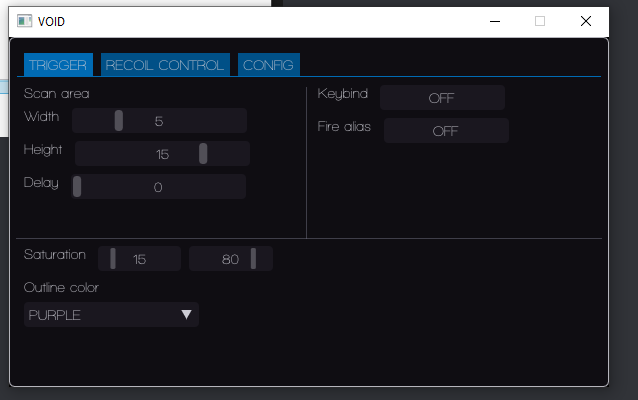

# VALORANT  
Undetected external cheat using HSV color detection.  
This will not mess with the addresses and memories of the game, it's 100% memory independent.  
  
Customizable via menu.  
- Panic key is 'Del', press it to exit the cheat.  
  
    
 
# INFO    
- Change the saturation if it's shoting poorly or not shoting.  
The default saturation is 15 - 80 (Min - Max)       
Select a 'Keybind' and alias it to Valorant as a seconday fire key.   

# WARNING  
This project won't be continued.  
I've not tested the cheat since 'first commit' release date.  

## COMPILATION   
You need to download [GLFW pre-compiled binaries](https://www.glfw.org/download) and add the `/include` folder to the Include path.  
Also include `/vs-XXXX` (XXXX = Visual Studio Version, ex: vs-2022 for VStudio 2022) to the lib folder. 
  
  
Feel free to make pull/reqs or collaborate.   
